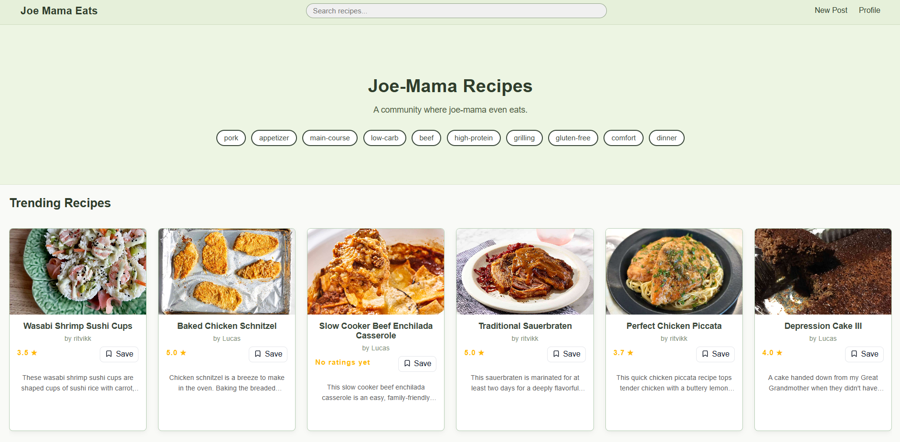
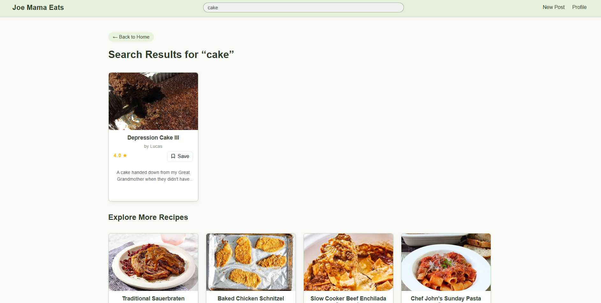
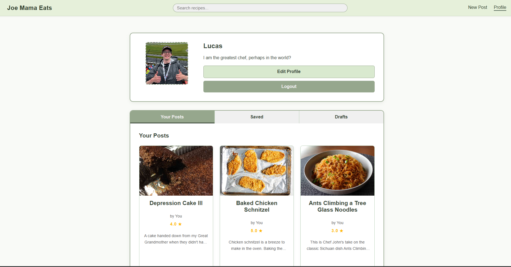
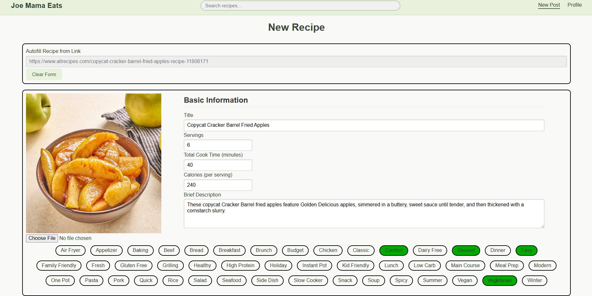
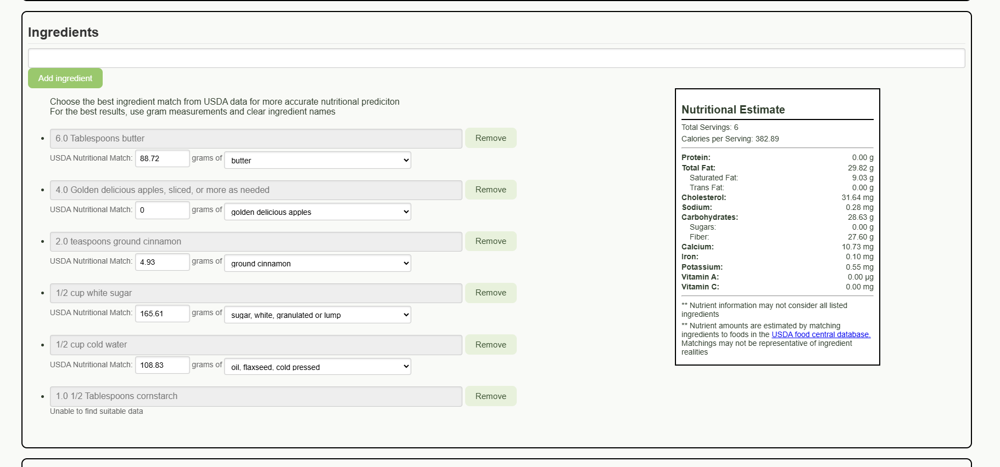
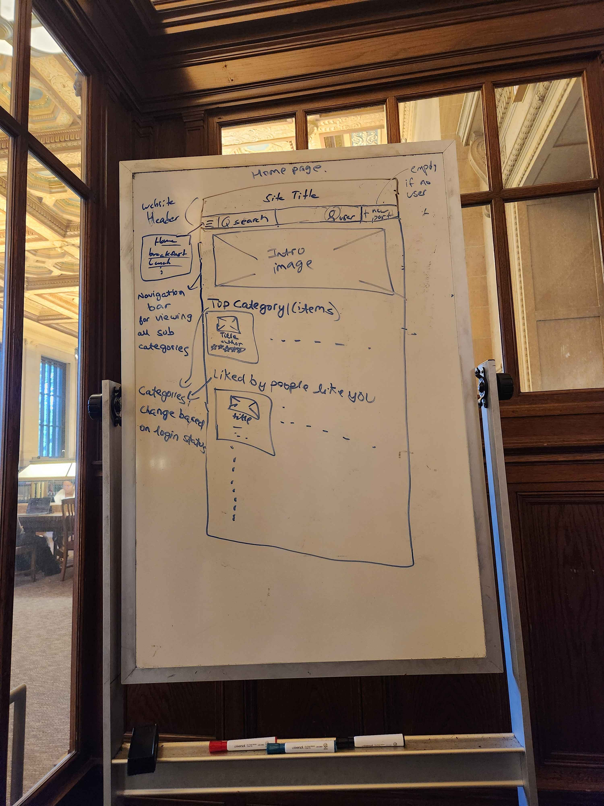
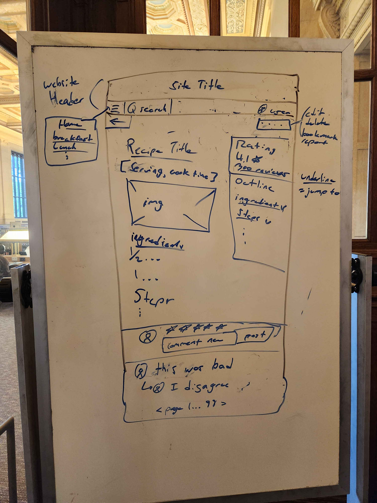
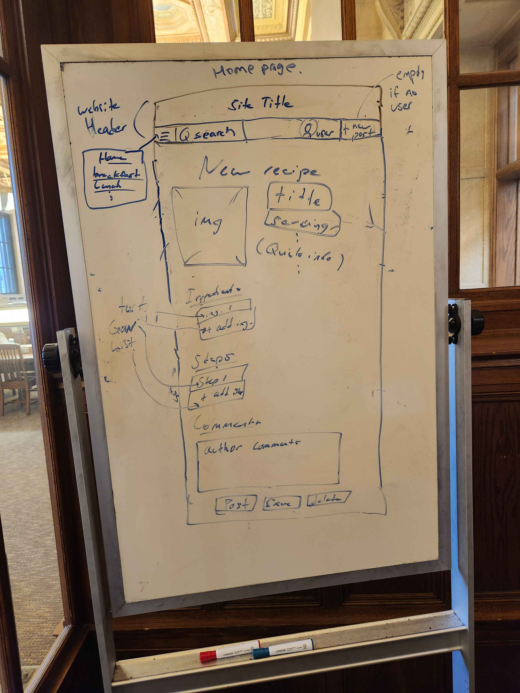
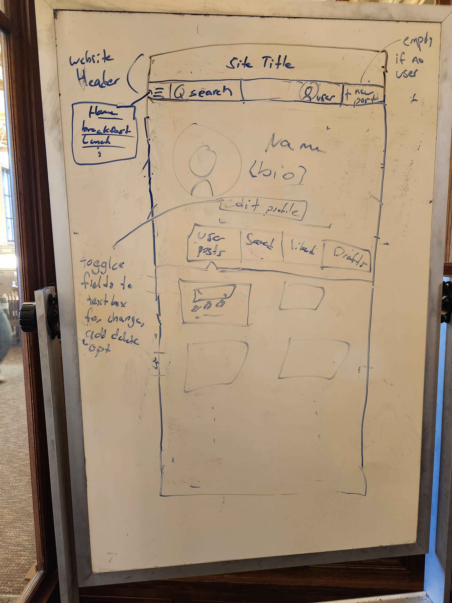

# Module 1 Group Assignment

CSCI 5117, Fall 2024, [assignment description](https://canvas.umn.edu/courses/460699/pages/project-1)

## App Info:

* Team Name: 503-402
* App Name: Joe-Mama Recipes
* App Link: <https://project-1-503-402.onrender.com>

### Students

* Lucas Olsen, olse0280@umn.edu
* Hanan Abdirahman, abdir074@umn.edu
* Nitish Kumar, yarla021@umn.edu
* Ritvik Kosuri, kosur005@umn.edu

## Key Features

**Describe the most challenging features you implemented
(one sentence per bullet, maximum 4 bullets):**

* Nutrition Estimation - There is a lot happening behind the scenes, but the gist is: parse an ingredient, query the USDA food central API for matching ingredients, approximate mass from parsed input amount, then approximate nutrition with USDA data and approximate mass

## Testing Notes

**Is there anything special we need to know in order to effectively test your app? (optional):**

* The app should work out of the box.  Our database will have been reset after the presentation, so data may not be the same as seen on demo day

## Screenshots of Site

**[Add a screenshot of each key page (around 4)](https://stackoverflow.com/questions/10189356/how-to-add-screenshot-to-readmes-in-github-repository)
along with a very brief caption:**

Our home page, quick recipe categories for quick useage

Search page, implements search.  Users can search by title or tags

Recipe page, displays our recipes - includes title / info, ingredients, steps, comments, and a nutritional estimate.

Profile page, our users can edit their profile and view their posted, saved, and draft recipes

New recipe, users can create a new recipe with a standard form OR they can use a link to an existing website to autofill parts of the form.

Our big feature - nutrition estimation.  Each ingredient is parsed and matched to USDA nutritional data.  Its not always right, but the user has an opprotunity to change the estimates for a better approximation

## Mock-up 

Our recipe recommendation website will be built around users sharing and interacting with other recipes hosted on the site.  Below are the initial whiteboard mockups created to outline our website's initial design and structure 

### Home Page

The home page for our website.  It includes a large, attention-grabbing image that showcases categories for users to browse within subpages of the site.  Below the image follows a series of recommendation scroll-bars with category titles "trending", "for you", etc. that change based on the user's login status.  Under each scroll bar contains a 'recipe card' that lists brief info such as the title, rating, and an image.  Each card links to the recipe's individual 'recipe page' which is sketched out later.

### Category Page

Our website includes specific category subpages such as "breakfast", "lunch", and "dinner" (among others) that give top recommendations for the category selected.  This page displays similarily to the home page with sub category recommendation scroll-bars that recommend users different recipes based on the sub category.

### Recipe Page

This page displays all the information related to a singular recipe.  A recipe title is followed by an image and quick info such as servings or prep time, followed by ingredients, followed by recipe steps, and finalized with a comment section.  The comment section contains a max number of comments that can be paged through from any logged in user that decided to post a review or rating.  Users can reply to other comments and delete their own.  The right side of the page contains a 'quick outline' that shows brief ratingreach scroll bar is a  statistics, recipe sections, etc.

### Recipe Form

This page is for posting a new recipe.  Users will see a default form with fields for title, servings, image, ingredients, steps, and 'chef comments'.  The user can post, save a draft, or delete the recipe at the bottom of the form.

### User Profile

This is a user profile page, any user that creates an account will have their own user page.  This page contains user info in a short bio with an edit profile button to change fields related to their account or delete it.  The sectional bar below the 'edit profile' button allows users to see recipe cards they have posted, saved, liked, and are drafting.

## External Dependencies

**Document integrations with 3rd Party code or services here.
Please do not document required libraries. or libraries that are mentioned in the product requirements**

* recipe-scrapers - python package for scraping recipes from the web (https://github.com/hhursev/recipe-scrapers)
* ingredient-parser-nlp - python package for parsing ingredient strings (https://ingredient-parser.readthedocs.io/en/latest/)
* pint - python package for unit conversion (https://pint.readthedocs.io/en/stable/)
* USDA Food central database - for nutritional information (https://fdc.nal.usda.gov/api-guide)

**If there's anything else you would like to disclose about how your project
relied on external code, expertise, or anything else, please disclose that
here:**

* For ingredient estimation, a spreadsheet of densities was gerenrated by an LLM to estimate food density by food category.  This is used by our ingredient parser to convert volume amounts into mass estimations.
